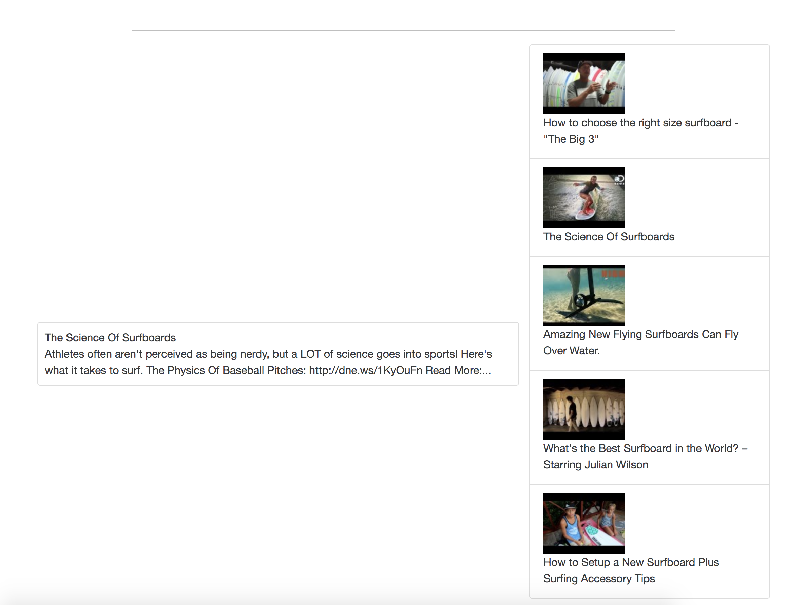

# YT_PLAYER

This is a custom youtube player made using yotube api and reactjs.This allows you to create your custom youtube viewer by using just basic style techniques by using css and sass

## Contibution

If you would like to contribute to this repo, just create an issue and make a PR

## Maintainers
As of now, I am the only maintainer.For any queries contact me [here](https://github.com/stealthanthrax).

## Screenshots
Below are some screenshots

## Steps to Test the app
* Clone this repo 
* npm install
* npm start
